

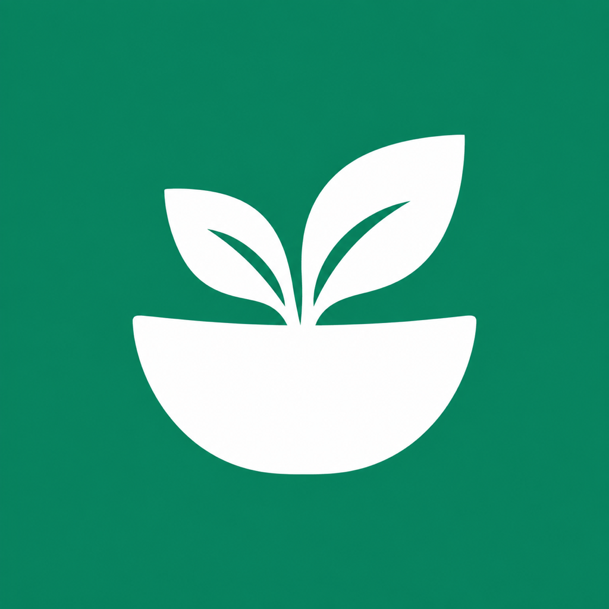
<h1>NutriGo</h1>

<strong>Your food. Your rhythm.</strong>

A considered space for nutrition, everyday progress, and sharing meals.

iPhone & Android · Development preview

## A clearer picture of your day

NutriGo brings food logging, water, nutrition, and everyday progress into one calm interface. An emerald accent, warm neutral surfaces, and expressive food icons give every screen a shared identity.

<table>
<tr>
<td align="center" width="33%">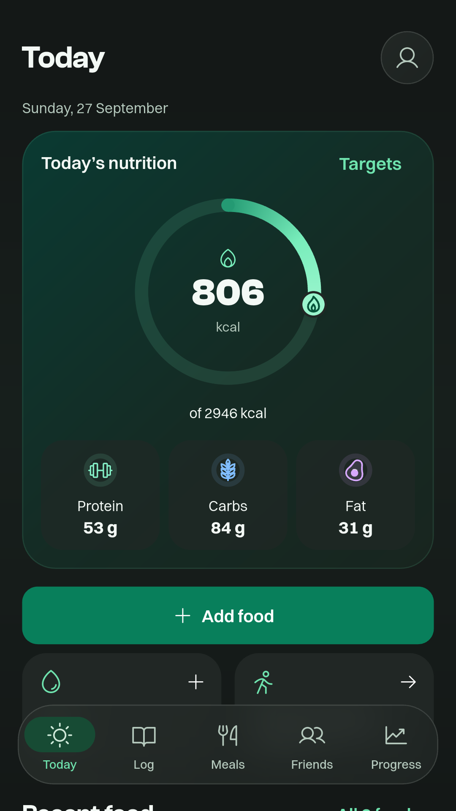 <strong>Today</strong> Nutrition at a glance.</td>
<td align="center" width="33%">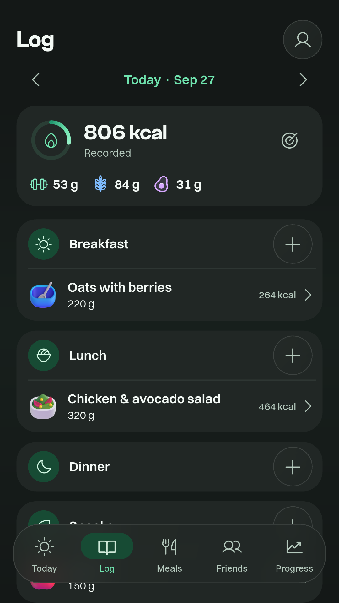 <strong>Log</strong> Your meals, in context.</td>
<td align="center" width="33%">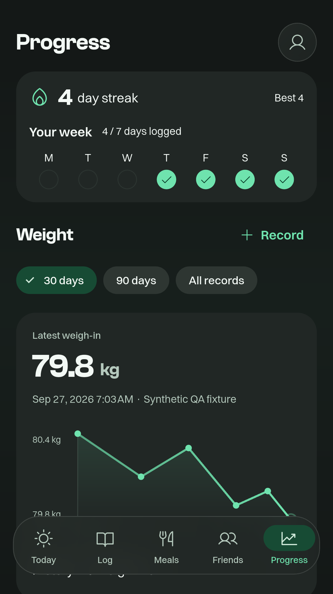 <strong>Progress</strong> See the routine take shape.</td>
</tr>
</table>

## From “what’s for dinner?” to a plan

Keep ingredients in **My fridge** and discover published recipes with ingredient matches, missing items, serving calories, and source links. Food search displays brands, calories and serving basis. Source-backed slices, tablespoons and other household measures support fractional portions. Meals stay editable after logging.

<table>
<tr>
<td align="center" width="33%">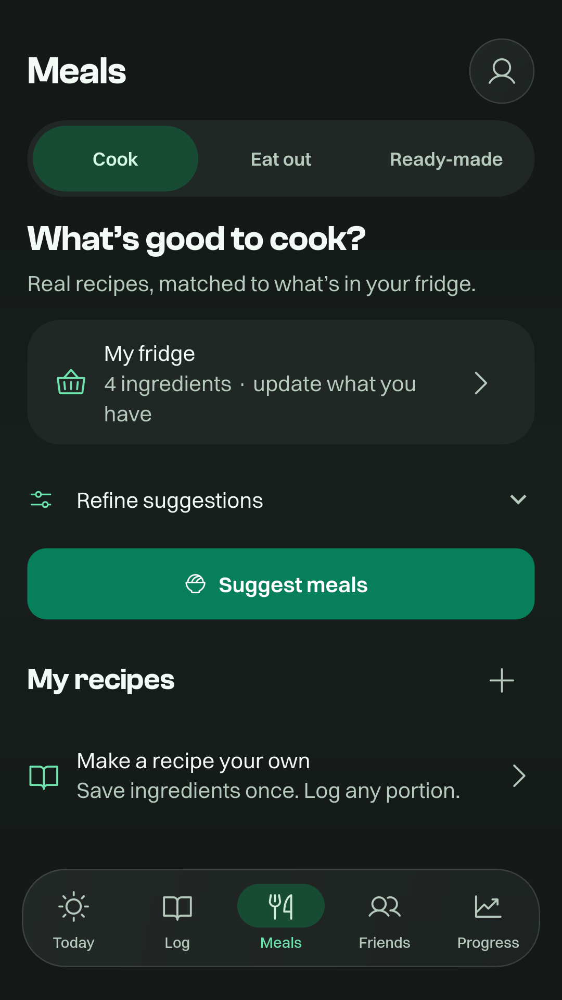 <strong>Meals</strong></td>
<td align="center" width="33%">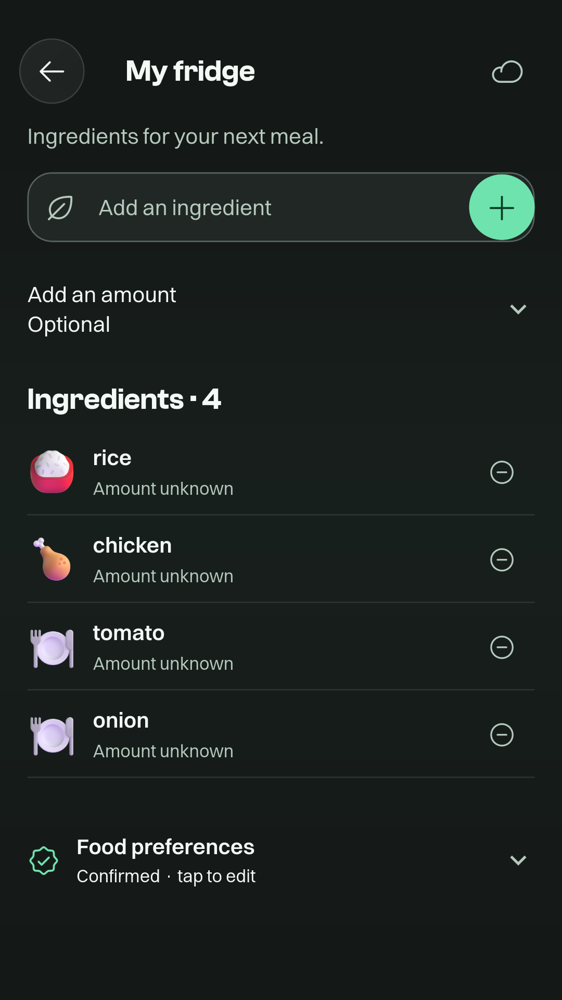 <strong>My fridge</strong></td>
<td align="center" width="33%">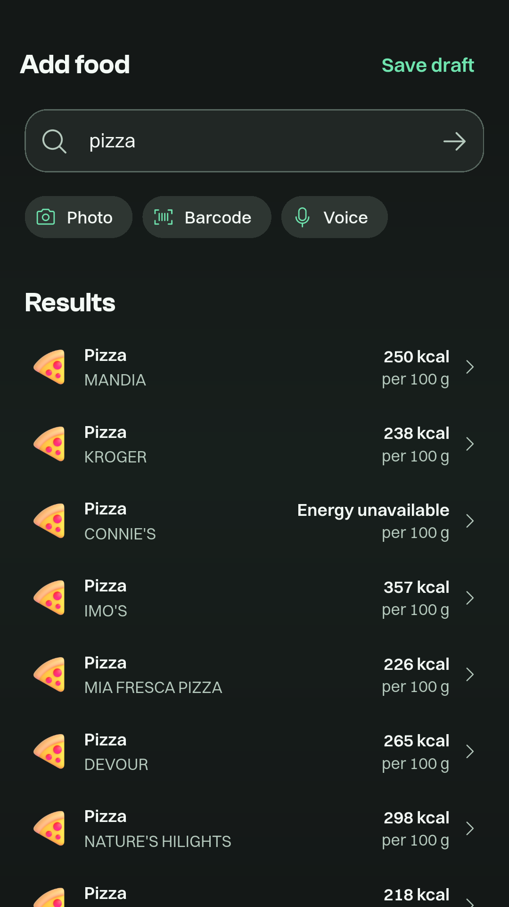 <strong>Food search</strong></td>
</tr>
</table>

## A little company along the way

Private sharing, handles, friends, and circles connect the people you choose. Profiles emphasize identity and a logging streak, with a separate private health overview. Streaks reflect food actually logged; there is no separate “finished today” switch.

<table>
<tr>
<td align="center" width="50%">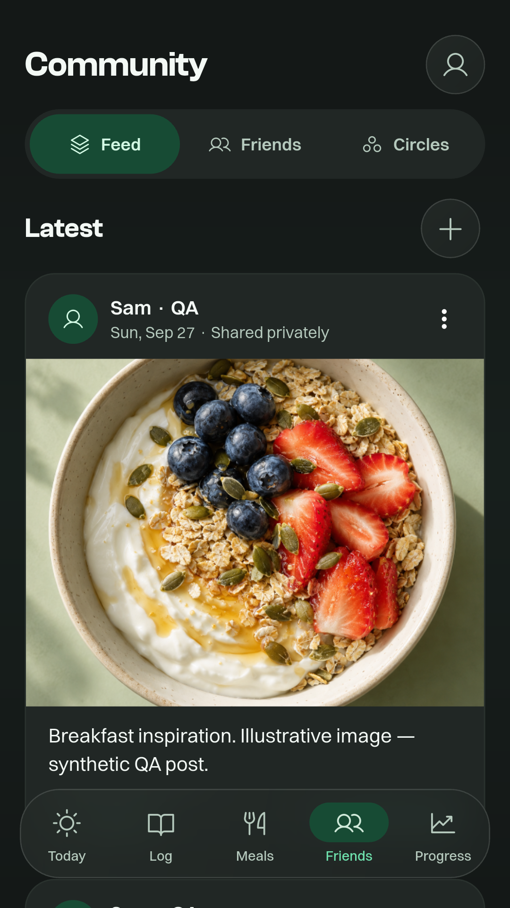 <strong>Community</strong></td>
<td align="center" width="50%">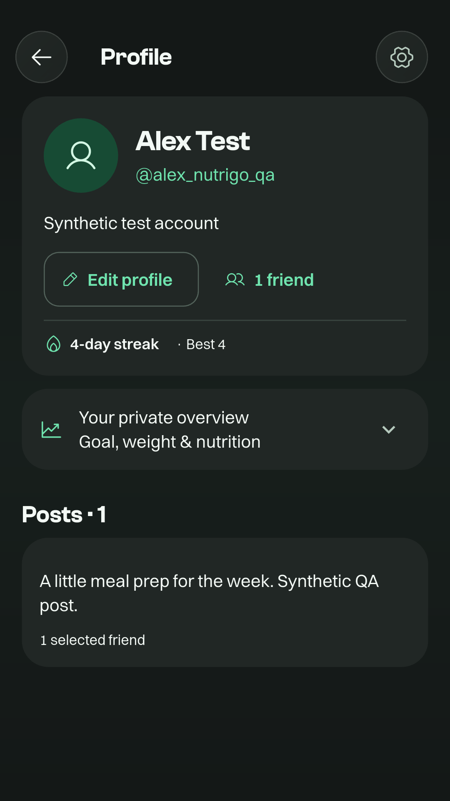 <strong>Profile</strong></td>
</tr>
</table>

## Light when you want it

<table><tr>
<td align="center" width="50%">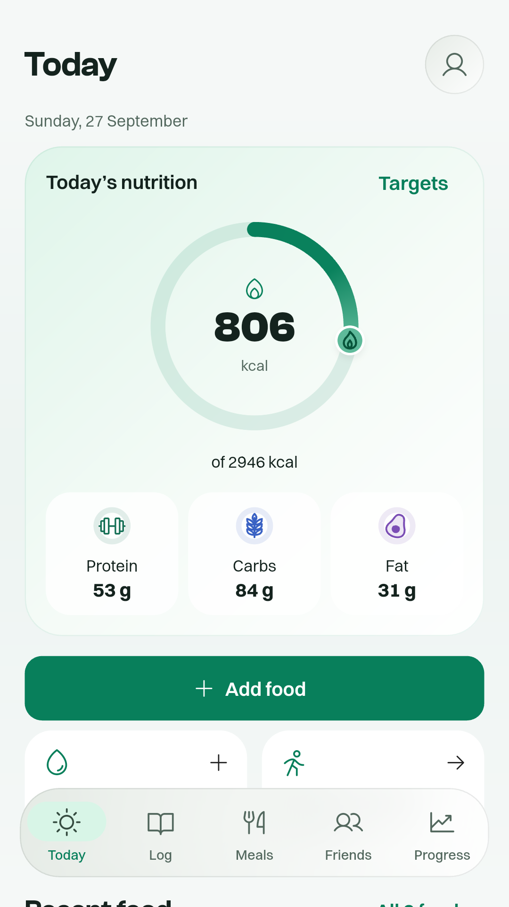</td>
<td align="center" width="50%">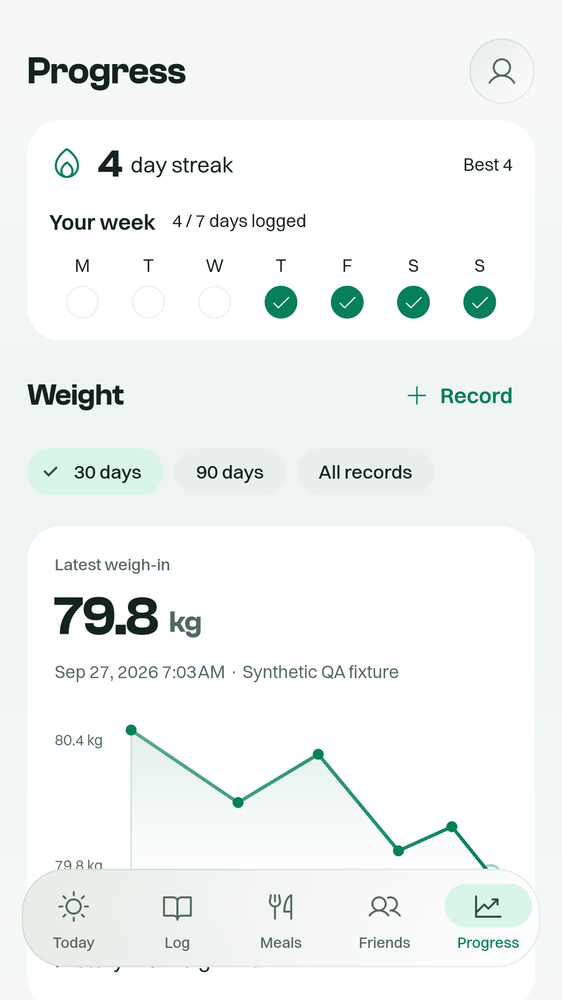</td>
</tr></table>

## Built with care

- Flutter interface with native iOS navigation materials and Android platform integrations.
- Durable local logging, account-bound synchronization, and an authenticated backend.
- Optional Apple Health and Health Connect water export, with stable IDs for retries and deletion handling.
- Clear missing-data states, editable portions, reduced-motion support, and scalable text.
- Weekly check-ins based on recorded days, separate from measured-health views.
- Configurable Home Screen and Lock Screen widgets for summary metrics and quick logging. Android lock-screen availability depends on the device; physical host verification remains pending.

## Preview notes

The main gallery uses actual Android emulator captures of the development app. The iOS section below uses actual iPhone simulator captures. Both use a synthetic test account. The shared breakfast illustration is a test image. This repository is a visual showcase; application source, backend code, credentials, and test-account configuration remain private.

The app is under active development and is not yet a store release. Physical-device health sync, push delivery, production sign-in, AI food inference, and wider licensed restaurant coverage still require final provider/device validation. The 233-recipe development catalogue comes from MedlinePlus, with a weekly refresh implementation and a last-good fallback. Its production scheduler is not yet deployed. Published recipe suggestions are source-based; this preview does not claim every restaurant or allergy-safe recommendations.

## A useful glance outside the app

<table><tr><td width="50%">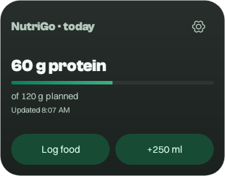</td><td width="50%">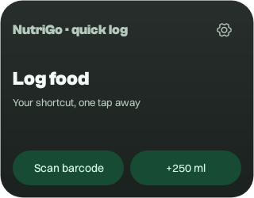</td></tr></table>

These are native Android widget renders from QA tests. Choose a summary, focused metric or quick shortcut. Metrics are private by default, and water actions require unlock. iOS includes Home Screen and circular, inline and rectangular Lock Screen layouts; Android lock-screen availability varies by device. Actual lock-screen host behavior remains a physical-device check.

## Native on iPhone

<table><tr><td align="center" width="50%">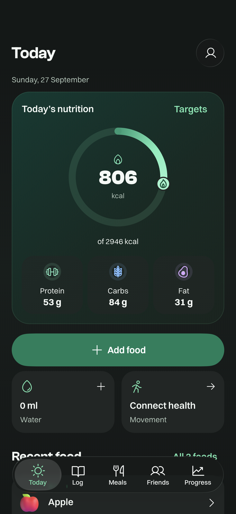 Today on iOS</td><td align="center" width="50%">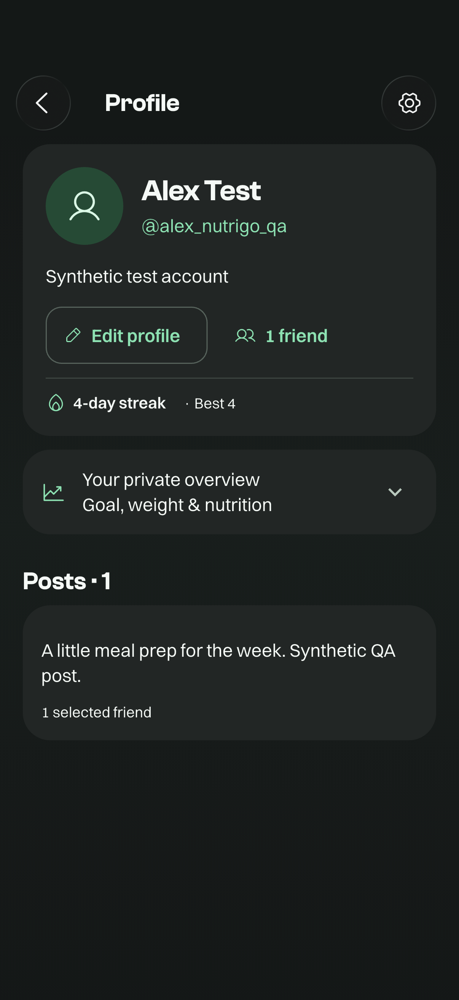 Profile on iOS</td></tr></table>

**[View the showcase layout](index.html)** · **[Screenshot notes](SCREENSHOTS.md)**

---

© 2026 NutriGo. Brand and showcase materials are reserved to their owner. Restaurant and data-provider names belong to their respective owners; no affiliation is implied.
